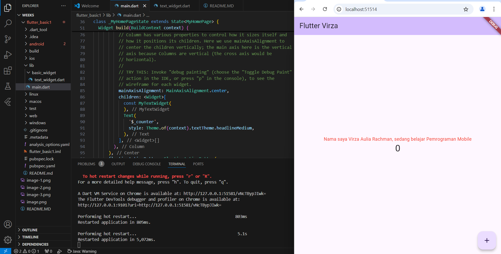
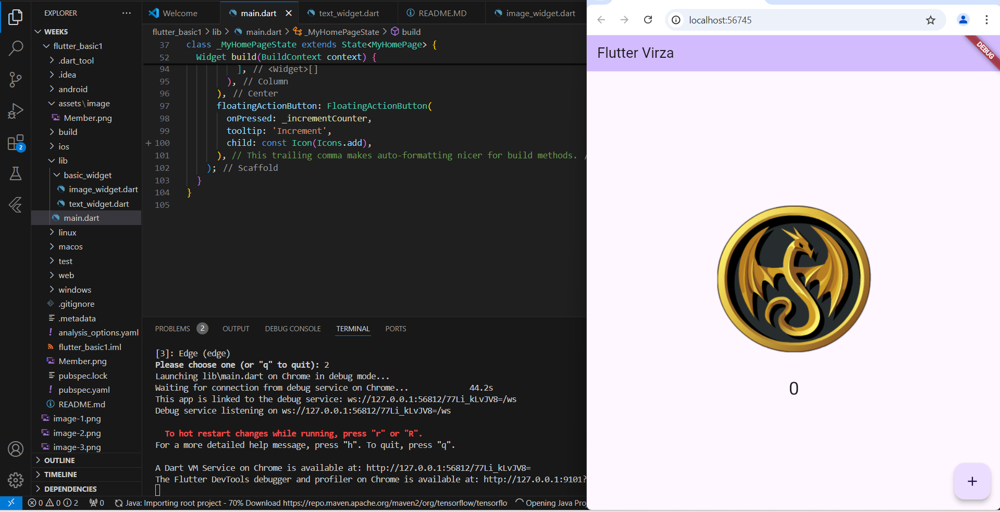

##  - Creating new Flutter projecct
!

##  - New Flutter Project 

##  - Widget

### 1.Text Widget

Import File 

Call then Run,Boom W flutter

### 2.Image widget

### 3.Image with Text Widget (assign3)

##  Practicum 5
## - Scaffold 

## - Dialog (Alert)

## - Input and Selection Widget

